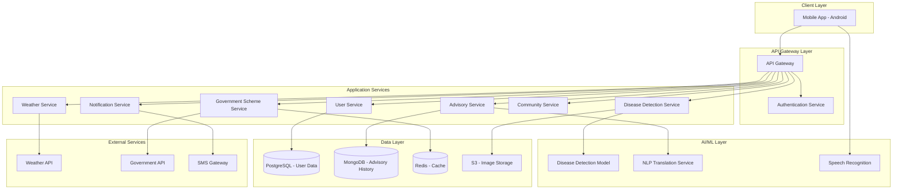

# Design Document: Agrinext

## Overview

Agrinext is a comprehensive mobile-first agricultural advisory platform designed for rural Indian farmers. The system addresses three critical challenges: providing real-time agronomy advice, enabling multilingual access to government schemes, and offering early crop disease detection through AI-powered image analysis.

The architecture follows a microservices approach with a mobile application frontend, RESTful API backend, AI/ML services for disease detection, and integration with external services for weather data and government scheme information. The system is designed to handle intermittent connectivity common in rural areas through offline-first capabilities and intelligent data synchronization.

### Key Design Principles

1. **Mobile-First**: Optimized for low-end Android devices with limited storage and processing power
2. **Offline-First**: Core features available without continuous internet connectivity
3. **Multilingual**: All user-facing content available in 10+ Indian regional languages
4. **Scalability**: Designed to serve millions of farmers across India
5. **Privacy**: Strong data protection and user consent mechanisms
6. **Accessibility**: Voice input/output for users with limited literacy

## Architecture

### High-Level Architecture



### Architecture Decisions

**Mobile Platform**: Android-first approach targeting API level 21+ (Android 5.0+) to maximize reach in rural India where older devices are common.

**Backend**: Node.js with Express for API services, Python for AI/ML services. This separation allows independent scaling and technology optimization for each concern.

**Database Strategy**:
- PostgreSQL for structured user data requiring ACID properties
- MongoDB for flexible advisory content and history
- Redis for caching frequently accessed data (schemes, weather)

**AI/ML Deployment**: TensorFlow Lite models deployed on-device for basic disease detection (offline), with cloud-based models for complex analysis requiring more computational power.

**Offline Strategy**: Service workers and local SQLite database on mobile app for offline data storage, with background sync when connectivity is restored.

## Components and Interfaces

### 1. Mobile Application (Android)

**Technology**: Kotlin with Jetpack Compose for UI, Room for local database, WorkManager for background sync.

**Key Modules**:
- Authentication Module
- Advisory Module
- Disease Detection Module
- Government Scheme Browser
- Community Forum
- Profile Management
- Offline Sync Manager

**Local Storage**:
```kotlin
// Room Database Schema
@Entity(tableName = "cached_advisories")
data class CachedAdvisory(
    @PrimaryKey val id: String,
    val content: String,
    val language: String,
    val timestamp: Long,
    val cropType: String
)

@Entity(tableName = "pending_uploads")
data class PendingUpload(
    @PrimaryKey val id: String,
    val imageUri: String,
    val cropType: String,
    val timestamp: Long,
    val syncStatus: SyncStatus
)
```

**Offline Detection Interface**:
```kotlin
interface OfflineDiseaseDetector {
    suspend fun detectDisease(imageBitmap: Bitmap): DiseaseResult
    fun isModelAvailable(): Boolean
    suspend fun updateModel(modelBytes: ByteArray)
}

data class DiseaseResult(
    val diseaseName: String,
    val confidence: Float,
    val severity: DiseaseSeverity,
    val recommendations: List<String>
)
```

### 2. API Gateway

**Technology**: Kong or AWS API Gateway

**Responsibilities**:
- Request routing
- Rate limiting (100 requests/minute per user)
- Authentication token validation
- Request/response logging
- API versioning

**Endpoints Structure**:
```
/api/v1/auth/*          - Authentication endpoints
/api/v1/advisory/*      - Advisory service endpoints
/api/v1/schemes/*       - Government scheme endpoints
/api/v1/diseases/*      - Disease detection endpoints
/api/v1/users/*         - User management endpoints
/api/v1/community/*     - Community forum endpoints
/api/v1/weather/*       - Weather service endpoints
/api/v1/notifications/* - Notification endpoints
```

### 3. Authentication Service

**Technology**: Node.js with JWT tokens

**Interface**:
```typescript
interface AuthService {
  // Register new user with mobile number
  register(mobile: string, profile: UserProfile): Promise<AuthResponse>
  
  // Send OTP to mobile number
  sendOTP(mobile: string): Promise<OTPResponse>
  
  // Verify OTP and issue JWT token
  verifyOTP(mobile: string, otp: string): Promise<TokenResponse>
  
  // Refresh expired token
  refreshToken(refreshToken: string): Promise<TokenResponse>
  
  // Logout and invalidate token
  logout(token: string): Promise<void>
}

interface UserProfile {
  name: string
  location: GeoLocation
  crops: string[]
  farmSize: number
  language: string
}

interface TokenResponse {
  accessToken: string
  refreshToken: string
  expiresIn: number
}
```

**Security**:
- JWT tokens with 1-hour expiration
- Refresh tokens with 30-day expiration
- OTP valid for 5 minutes
- Rate limiting on OTP requests (3 per hour per mobile)

### 4. Advisory Service

**Technology**: Node.js with Express

**Interface**:
```typescript
interface AdvisoryService {
  // Get personalized advisory based on query
  getAdvisory(query: AdvisoryQuery): Promise<Advisory>
  
  // Get proactive advisories based on weather/season
  getProactiveAdvisories(userId: string): Promise<Advisory[]>
  
  // Get advisory history for user
  getHistory(userId: string, filters: HistoryFilters): Promise<Advisory[]>
  
  // Rate advisory helpfulness
  rateAdvisory(advisoryId: string, rating: number): Promise<void>
  
  // Search knowledge base
  searchKnowledge(query: string, language: string): Promise<KnowledgeArticle[]>
}

interface AdvisoryQuery {
  userId: string
  question: string
  cropType: string
  language: string
  location: GeoLocation
}

interface Advisory {
  id: string
  content: string
  language: string
  cropType: string
  category: AdvisoryCategory
  timestamp: Date
  sources: string[]
  relatedArticles: string[]
}

enum AdvisoryCategory {
  IRRIGATION = "irrigation",
  FERTILIZATION = "fertilization",
  PEST_CONTROL = "pest_control",
  HARVESTING = "harvesting",
  SOIL_MANAGEMENT = "soil_management",
  WEATHER_RELATED = "weather_related"
}
```

**Knowledge Base Structure**:
- 50+ major crops with detailed cultivation guides
- Regional best practices
- Seasonal advisories
- Weather-based recommendations
- Pest and disease management

### 5. Disease Detection Service

**Technology**: Python with FastAPI, TensorFlow/PyTorch

**Interface**:
```python
from typing import List, Optional
from pydantic import BaseModel

class DiseaseDetectionRequest(BaseModel):
    image_url: str
    crop_type: str
    user_id: str
    location: GeoLocation

class DiseaseDetectionResponse(BaseModel):
    disease_id: str
    disease_name: str
    confidence: float
    severity: str  # "low", "medium", "high", "critical"
    affected_area_percentage: float
    treatment_recommendations: List[Treatment]
    preventive_measures: List[str]
    estimated_yield_impact: str

class Treatment(BaseModel):
    name: str
    description: str
    application_method: str
    dosage: str
    timing: str
    cost_estimate: float
    organic_alternative: Optional[str]

class DiseaseDetectionService:
    async def detect_disease(
        self, 
        request: DiseaseDetectionRequest
    ) -> DiseaseDetectionResponse:
        """Analyze crop image and detect diseases"""
        pass
    
    async def validate_image_quality(
        self, 
        image_url: str
    ) -> ImageQualityResult:
        """Check if image is suitable for analysis"""
        pass
    
    async def get_disease_history(
        self, 
        user_id: str, 
        crop_type: Optional[str]
    ) -> List[DiseaseDetectionResponse]:
        """Get user's disease detection history"""
        pass
    
    async def report_outbreak(
        self, 
        disease_id: str, 
        location: GeoLocation
    ) -> None:
        """Report disease outbreak for regional alerts"""
        pass
```

**ML Model Architecture**:
- Base Model: MobileNetV3 or EfficientNet-Lite for mobile deployment
- Training Data: 100,000+ labeled images across 50+ diseases
- On-device Model: TensorFlow Lite (< 10MB) for top 20 common diseases
- Cloud Model: Full model for comprehensive analysis
- Confidence Threshold: 85% for automatic diagnosis, manual review below

**Image Processing Pipeline**:
1. Image quality validation (resolution, blur, lighting)
2. Crop region detection and extraction
3. Disease classification
4. Severity assessment
5. Treatment recommendation generation
6. Result translation to user's language

### 6. Government Scheme Service

**Technology**: Node.js with Express

**Interface**:
```typescript
interface GovernmentSchemeService {
  // Get all schemes filtered by eligibility
  getSchemes(filters: SchemeFilters): Promise<Scheme[]>
  
  // Get detailed scheme information
  getSchemeDetails(schemeId: string, language: string): Promise<SchemeDetails>
  
  // Check user eligibility for scheme
  checkEligibility(schemeId: string, userId: string): Promise<EligibilityResult>
  
  // Submit scheme application
  applyForScheme(application: SchemeApplication): Promise<ApplicationResult>
  
  // Track application status
  trackApplication(applicationId: string): Promise<ApplicationStatus>
  
  // Get application history
  getApplicationHistory(userId: string): Promise<Application[]>
}

interface SchemeFilters {
  cropType?: string
  state?: string
  district?: string
  category?: SchemeCategory
  language: string
}

interface Scheme {
  id: string
  name: string
  description: string
  benefits: string[]
  eligibility: EligibilityCriteria[]
  documents_required: string[]
  application_deadline: Date
  category: SchemeCategory
  implementing_agency: string
}

interface SchemeApplication {
  scheme_id: string
  user_id: string
  documents: Document[]
  additional_info: Record<string, any>
}

interface ApplicationStatus {
  application_id: string
  status: ApplicationState
  submitted_date: Date
  last_updated: Date
  remarks: string
  next_steps: string[]
}

enum ApplicationState {
  SUBMITTED = "submitted",
  UNDER_REVIEW = "under_review",
  APPROVED = "approved",
  REJECTED = "rejected",
  DOCUMENTS_REQUIRED = "documents_required",
  DISBURSED = "disbursed"
}
```

**Scheme Categories**:
- Crop Insurance
- Subsidies (seeds, fertilizers, equipment)
- Loan schemes
- Training programs
- Market linkage programs
- Irrigation support

### 7. Notification Service

**Technology**: Node.js with Bull queue for job processing

**Interface**:
```typescript
interface NotificationService {
  // Send immediate notification
  sendNotification(notification: Notification): Promise<void>
  
  // Schedule notification
  scheduleNotification(notification: Notification, scheduleTime: Date): Promise<string>
  
  // Send bulk notifications to region
  sendRegionalAlert(alert: RegionalAlert): Promise<void>
  
  // Get user notification preferences
  getPreferences(userId: string): Promise<NotificationPreferences>
  
  // Update notification preferences
  updatePreferences(userId: string, prefs: NotificationPreferences): Promise<void>
}

interface Notification {
  user_id: string
  title: string
  body: string
  type: NotificationType
  priority: Priority
  language: string
  data: Record<string, any>
  channels: NotificationChannel[]
}

enum NotificationType {
  WEATHER_ALERT = "weather_alert",
  DISEASE_OUTBREAK = "disease_outbreak",
  SCHEME_DEADLINE = "scheme_deadline",
  ADVISORY = "advisory",
  COMMUNITY_REPLY = "community_reply",
  APPLICATION_UPDATE = "application_update"
}

enum NotificationChannel {
  PUSH = "push",
  SMS = "sms",
  IN_APP = "in_app"
}

interface RegionalAlert {
  region: GeoRegion
  notification: Notification
  radius_km: number
}
```

**Notification Rules**:
- Critical weather alerts: Push + SMS
- Disease outbreaks: Push notification
- Scheme deadlines: Push notification 7 days and 1 day before
- Community replies: In-app notification only
- Quiet hours: 9 PM - 7 AM (no push notifications)

### 8. Weather Service

**Technology**: Node.js with Express, integration with IMD (Indian Meteorological Department) API

**Interface**:
```typescript
interface WeatherService {
  // Get current weather for location
  getCurrentWeather(location: GeoLocation): Promise<WeatherData>
  
  // Get 7-day forecast
  getForecast(location: GeoLocation): Promise<WeatherForecast[]>
  
  // Get weather-based farming advisories
  getWeatherAdvisories(location: GeoLocation, cropType: string): Promise<Advisory[]>
  
  // Get historical weather data
  getHistoricalWeather(location: GeoLocation, days: number): Promise<WeatherData[]>
  
  // Check for severe weather alerts
  getSevereWeatherAlerts(location: GeoLocation): Promise<WeatherAlert[]>
}

interface WeatherData {
  temperature: number
  humidity: number
  rainfall: number
  wind_speed: number
  conditions: string
  timestamp: Date
}

interface WeatherForecast extends WeatherData {
  date: Date
  rainfall_probability: number
  min_temperature: number
  max_temperature: number
}

interface WeatherAlert {
  alert_type: string
  severity: string
  description: string
  valid_from: Date
  valid_until: Date
  affected_areas: string[]
  recommendations: string[]
}
```

### 9. Community Service

**Technology**: Node.js with Express, WebSocket for real-time updates

**Interface**:
```typescript
interface CommunityService {
  // Create new post
  createPost(post: CommunityPost): Promise<Post>
  
  // Get posts for region/crop
  getPosts(filters: PostFilters): Promise<Post[]>
  
  // Reply to post
  replyToPost(postId: string, reply: Reply): Promise<Reply>
  
  // Like/upvote post
  likePost(postId: string, userId: string): Promise<void>
  
  // Report inappropriate content
  reportPost(postId: string, reason: string): Promise<void>
  
  // Get trending topics
  getTrendingTopics(region: string): Promise<Topic[]>
}

interface CommunityPost {
  user_id: string
  content: string
  language: string
  crop_type: string
  region: string
  images: string[]
  tags: string[]
}

interface Post extends CommunityPost {
  id: string
  author_name: string
  timestamp: Date
  likes: number
  replies: number
  is_verified_response: boolean
}
```

### 10. User Service

**Technology**: Node.js with Express

**Interface**:
```typescript
interface UserService {
  // Get user profile
  getProfile(userId: string): Promise<UserProfile>
  
  // Update user profile
  updateProfile(userId: string, updates: Partial<UserProfile>): Promise<UserProfile>
  
  // Add crop to user profile
  addCrop(userId: string, crop: CropInfo): Promise<void>
  
  // Remove crop from user profile
  removeCrop(userId: string, cropId: string): Promise<void>
  
  // Get user statistics
  getStatistics(userId: string): Promise<UserStatistics>
  
  // Delete user account
  deleteAccount(userId: string): Promise<void>
}

interface CropInfo {
  crop_type: string
  area: number
  sowing_date: Date
  expected_harvest_date: Date
}

interface UserStatistics {
  total_queries: number
  diseases_detected: number
  schemes_applied: number
  community_posts: number
  member_since: Date
}
```

## Data Models

### User Data (PostgreSQL)

```sql
CREATE TABLE users (
    id UUID PRIMARY KEY DEFAULT gen_random_uuid(),
    mobile_number VARCHAR(15) UNIQUE NOT NULL,
    name VARCHAR(100) NOT NULL,
    language VARCHAR(10) NOT NULL,
    state VARCHAR(50),
    district VARCHAR(50),
    village VARCHAR(100),
    latitude DECIMAL(10, 8),
    longitude DECIMAL(11, 8),
    farm_size DECIMAL(10, 2),
    created_at TIMESTAMP DEFAULT CURRENT_TIMESTAMP,
    updated_at TIMESTAMP DEFAULT CURRENT_TIMESTAMP,
    last_login TIMESTAMP,
    is_active BOOLEAN DEFAULT true
);

CREATE TABLE user_crops (
    id UUID PRIMARY KEY DEFAULT gen_random_uuid(),
    user_id UUID REFERENCES users(id) ON DELETE CASCADE,
    crop_type VARCHAR(50) NOT NULL,
    area DECIMAL(10, 2),
    sowing_date DATE,
    expected_harvest_date DATE,
    created_at TIMESTAMP DEFAULT CURRENT_TIMESTAMP
);

CREATE TABLE user_preferences (
    user_id UUID PRIMARY KEY REFERENCES users(id) ON DELETE CASCADE,
    notification_enabled BOOLEAN DEFAULT true,
    sms_enabled BOOLEAN DEFAULT true,
    weather_alerts BOOLEAN DEFAULT true,
    disease_alerts BOOLEAN DEFAULT true,
    scheme_alerts BOOLEAN DEFAULT true,
    quiet_hours_start TIME DEFAULT '21:00',
    quiet_hours_end TIME DEFAULT '07:00'
);

CREATE TABLE scheme_applications (
    id UUID PRIMARY KEY DEFAULT gen_random_uuid(),
    user_id UUID REFERENCES users(id) ON DELETE CASCADE,
    scheme_id VARCHAR(100) NOT NULL,
    application_data JSONB,
    status VARCHAR(50) NOT NULL,
    submitted_at TIMESTAMP DEFAULT CURRENT_TIMESTAMP,
    updated_at TIMESTAMP DEFAULT CURRENT_TIMESTAMP,
    remarks TEXT
);
```

### Advisory Data (MongoDB)

```javascript
// advisories collection
{
  _id: ObjectId,
  user_id: String,
  query: String,
  response: String,
  language: String,
  crop_type: String,
  category: String,
  location: {
    type: "Point",
    coordinates: [longitude, latitude]
  },
  timestamp: Date,
  rating: Number,
  sources: [String],
  metadata: {
    weather_context: Object,
    season: String,
    response_time_ms: Number
  }
}

// knowledge_base collection
{
  _id: ObjectId,
  crop_type: String,
  topic: String,
  content: {
    en: String,
    hi: String,
    te: String,
    // ... other languages
  },
  category: String,
  tags: [String],
  region_specific: Boolean,
  applicable_states: [String],
  last_updated: Date,
  version: Number
}

// disease_detections collection
{
  _id: ObjectId,
  user_id: String,
  image_url: String,
  crop_type: String,
  disease_id: String,
  disease_name: String,
  confidence: Number,
  severity: String,
  location: {
    type: "Point",
    coordinates: [longitude, latitude]
  },
  timestamp: Date,
  treatment_provided: [Object],
  user_feedback: {
    was_accurate: Boolean,
    actual_disease: String,
    comments: String
  }
}

// community_posts collection
{
  _id: ObjectId,
  user_id: String,
  author_name: String,
  content: String,
  language: String,
  crop_type: String,
  region: String,
  state: String,
  district: String,
  images: [String],
  tags: [String],
  timestamp: Date,
  likes: Number,
  replies: [{
    user_id: String,
    author_name: String,
    content: String,
    timestamp: Date,
    is_verified: Boolean
  }],
  is_flagged: Boolean,
  flag_reason: String
}
```

### Cache Data (Redis)

```
// Weather cache (6-hour TTL)
weather:{latitude}:{longitude} -> JSON

// Scheme cache (24-hour TTL)
schemes:{state}:{language} -> JSON

// User session (1-hour TTL)
session:{token} -> JSON

// OTP cache (5-minute TTL)
otp:{mobile_number} -> String

// Rate limiting
ratelimit:{user_id}:{endpoint} -> Counter
```

