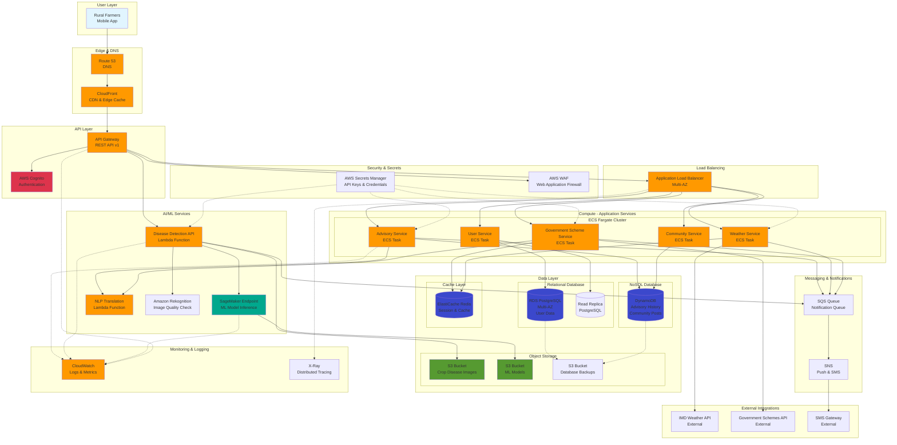

# Agrinext AWS Architecture Diagram

## High-Level AWS Infrastructure

## Detailed Component Breakdown

### 1. **Edge & DNS Layer**
- **Route 53**: DNS management and health checks
- **CloudFront**: CDN for static assets, API caching, and edge locations across India

### 2. **API & Security Layer**
- **API Gateway**: RESTful API endpoint management, rate limiting (100 req/min per user)
- **AWS Cognito**: User authentication with mobile OTP
- **AWS WAF**: Protection against common web exploits

### 3. **Compute Layer (ECS Fargate)**
- **Advisory Service**: Provides personalized farming advice
- **Government Scheme Service**: Manages scheme information and applications
- **User Service**: User profile and preference management
- **Community Service**: Forum and peer-to-peer communication
- **Weather Service**: Weather data aggregation and advisories

### 4. **AI/ML Layer**
- **Lambda (Disease Detection API)**: Serverless API for disease detection requests
- **SageMaker Endpoint**: Hosts TensorFlow/PyTorch models for disease classification
- **Lambda (NLP Translation)**: Translates content to 10+ Indian languages
- **Amazon Rekognition**: Validates image quality before ML processing

### 5. **Data Layer**
- **RDS PostgreSQL (Multi-AZ)**: User data, scheme applications, preferences
- **Read Replica**: Offload read queries for better performance
- **DynamoDB**: Advisory history, community posts, disease detection logs
- **ElastiCache Redis**: Session management, weather cache, scheme cache
- **S3 Buckets**: 
  - Crop disease images
  - ML model artifacts
  - Database backups

### 6. **Messaging & Notifications**
- **SQS**: Decouples notification generation from delivery
- **SNS**: Sends push notifications and SMS alerts

### 7. **Monitoring & Operations**
- **CloudWatch**: Centralized logging, metrics, and alarms
- **X-Ray**: Distributed tracing for performance optimization

### 8. **External Integrations**
- **IMD Weather API**: Real-time weather data
- **Government Schemes API**: Latest scheme information
- **SMS Gateway**: SMS delivery for critical alerts

## AWS Services Summary

| Service | Purpose | Configuration |
|---------|---------|---------------|
| Route 53 | DNS Management | Health checks, failover routing |
| CloudFront | CDN | Edge caching, HTTPS, India edge locations |
| API Gateway | API Management | REST API, rate limiting, API keys |
| Cognito | Authentication | Mobile OTP, JWT tokens |
| WAF | Security | SQL injection, XSS protection |
| ALB | Load Balancing | Multi-AZ, health checks |
| ECS Fargate | Container Orchestration | Auto-scaling, 2-10 tasks per service |
| Lambda | Serverless Compute | Disease detection, NLP translation |
| SageMaker | ML Model Hosting | Real-time inference endpoint |
| RDS PostgreSQL | Relational Database | Multi-AZ, automated backups |
| DynamoDB | NoSQL Database | On-demand capacity, global tables |
| ElastiCache Redis | Caching | Cluster mode, Multi-AZ |
| S3 | Object Storage | Versioning, lifecycle policies |
| SQS | Message Queue | Standard queue, DLQ enabled |
| SNS | Notifications | SMS, push notifications |
| Secrets Manager | Secret Management | Automatic rotation |
| CloudWatch | Monitoring | Logs, metrics, alarms |
| X-Ray | Tracing | Service map, latency analysis |

## Scalability & High Availability

### Auto-Scaling Configuration
- **ECS Services**: Scale 2-10 tasks based on CPU (70%) and memory (80%)
- **SageMaker**: Auto-scaling based on invocations per instance
- **DynamoDB**: On-demand capacity mode for unpredictable traffic
- **ElastiCache**: Cluster mode with 3-6 shards

### High Availability
- **Multi-AZ Deployment**: RDS, ALB, ECS tasks across 3 AZs
- **Read Replicas**: PostgreSQL read replica for query offloading
- **Health Checks**: ALB health checks every 30 seconds
- **Failover**: Automatic RDS failover in <2 minutes

### Disaster Recovery
- **RDS Backups**: Automated daily backups, 7-day retention
- **DynamoDB**: Point-in-time recovery enabled
- **S3 Versioning**: Enabled on all buckets
- **Cross-Region Replication**: S3 backup bucket replicated to secondary region

## Cost Optimization

1. **Compute**: ECS Fargate Spot for non-critical workloads (50% cost savings)
2. **Storage**: S3 Intelligent-Tiering for images (automatic cost optimization)
3. **Database**: RDS Reserved Instances (40% savings)
4. **Cache**: ElastiCache Reserved Nodes (30% savings)
5. **Lambda**: Provisioned concurrency only for disease detection API
6. **Data Transfer**: CloudFront reduces data transfer costs

## Security Architecture

1. **Network Security**: VPC with private subnets for databases and compute
2. **Encryption**: 
   - At rest: RDS, DynamoDB, S3 (AWS KMS)
   - In transit: TLS 1.2+ for all communications
3. **Access Control**: IAM roles with least privilege
4. **Secrets**: Secrets Manager with automatic rotation
5. **WAF Rules**: OWASP Top 10 protection
6. **DDoS Protection**: AWS Shield Standard (automatic)

## Estimated Monthly Cost (for 100,000 active users)

| Service | Estimated Cost |
|---------|----------------|
| ECS Fargate | $500 |
| Lambda | $200 |
| SageMaker | $800 |
| RDS PostgreSQL | $400 |
| DynamoDB | $300 |
| ElastiCache | $200 |
| S3 | $150 |
| CloudFront | $100 |
| API Gateway | $150 |
| SNS/SQS | $100 |
| Other Services | $100 |
| **Total** | **~$3,000/month** |

*Note: Costs scale with usage. Estimated for 100K active users with 1M API calls/day.*
